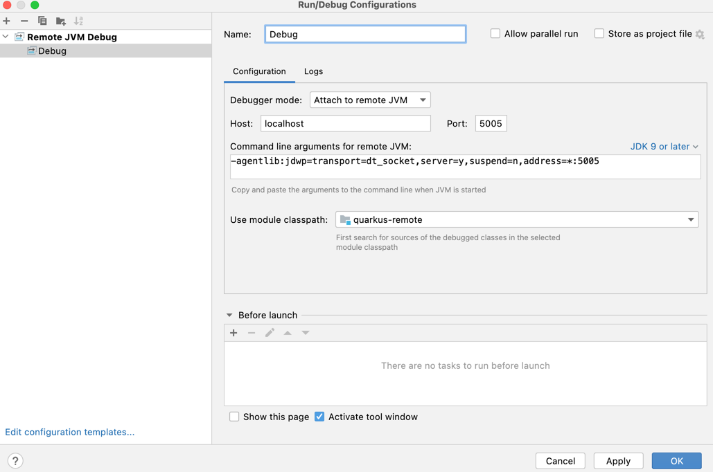

#### What is it?

https://youtu.be/aVXvDcHRJEQ

pelefele.com - real estate application. Backend is a java app implemented using Quarkus and running on AWS Fargate.
IAC with CDK/SST. 

This is an upgrade of initial version that can be found here:

https://github.com/stokilo/cloud-spider-public

Project configure domains for API (awss.ws) and web app (pelefele.com). These domains are configured for STAGE and PROD
environments with subdomains:

stage.pelefele.com (DEV) -> stage.alb.awss.ws

pelefele.com (PROD) -> alb.awss.ws


See LESSONS_LEARNED.MD for some technical notes.


#### Preparation

1. AWS Secret config

Note: all credentials for this setup are stored under single AWS secret with name:

```/account/api/secrets```

Secret is not provisioned. Must be created by hand using AWS Console. Check values from ```doc/social.md``

Current list of required secret keys:

```
PROD_FACEBOOK_CLIENT_SECRET	d888888888888888888888888888889d
STAGE_FACEBOOK_CLIENT_SECRET	d888888888888888888888888888889d
DEV_FACEBOOK_CLIENT_SECRET	d888888888888888888888888888889d

PROD_FACEBOOK_CLIENT_ID	444444444444862
STAGE_FACEBOOK_CLIENT_ID	444444444444862
DEV_FACEBOOK_CLIENT_ID	444444444444862

PROD_GOOGLE_CLIENT_ID	323333333336-ifjasiofjaisfjjfisafiasjomihsj3q.apps.googleusercontent.com
STAGE_GOOGLE_CLIENT_ID	323333333336-ifjasiofjaisfjjfisafiasjomihsj3q.apps.googleusercontent.com
DEV_GOOGLE_CLIENT_ID	323333333336-ifjasiofjaisfjjfisafiasjomihsj3q.apps.googleusercontent.com

PROD_GOOGLE_CLIENT_SECRET	ifiasjfiajsfiajsfi11sFZ-
STAGE_GOOGLE_CLIENT_SECRET	ifiasjfiajsfiajsfi11sFZ-
DEV_GOOGLE_CLIENT_SECRET	ifiasjfiajsfiajsfi11sFZ-

PROD_CLOUDFLARE_ACCOUNT_ID	c597c88a0e327181e73929291901213f
STAGE_CLOUDFLARE_ACCOUNT_ID	c597c88a0e327181e73929291901213f
DEV_CLOUDFLARE_ACCOUNT_ID	c597c88a0e327181e73929291901213f

PROD_CLOUDFLARE_ZONE_ID	239920390239032909023a91630db7c5
STAGE_CLOUDFLARE_ZONE_ID	239920390239032909023a91630db7c5
DEV_CLOUDFLARE_ZONE_ID	239920390239032909023a91630db7c5

PROD_CLOUDFLARE_API_TOKEN	ESlgJ9Fy1w5pCVOn23192910jfasfojaamE6jUAp
STAGE_CLOUDFLARE_API_TOKEN	ESlgJ9Fy1w5pCVOn23192910jfasfojaamE6jUAp
DEV_CLOUDFLARE_API_TOKEN	ESlgJ9Fy1w5pCVOn23192910jfasfojaamE6jUAp

PROD_HOSTED_ZONE_ID	2319239032j23OGQIKMIR
STAGE_HOSTED_ZONE_ID	2319239032j23OGQIKMIR
DEV_HOSTED_ZONE_ID	2319239032j23OGQIKMIR

-- these are for RDS but we can't rename them, this is pending
username: stokilo
password: sample_strong_password_129fsanklfnasklfnaslk1csavx

```

#### Build

Project scrips executes sso.sh script to acquire short living auth tokens. Comment out this if you are using
hardcoded credentials in ~/.aws/credentials file. 

Install dependencies

```bash
$ ./yarn install
$ frontend/yarn install
```

#### Stage and prod deployment (includes backend and frontend)

```bash
$ ./yarn deploy-stage
$ ./yarn deploy-prod
```
#### Backend development with live lambda reload

```bash
$ ./yarn start
```

#### Frontend development (localhost:3000)
```bash
$ frontend/yarn run dev
```

#### Remote Development

Currently, commented out from the code. It is required to add 5005 debug port to security groups (ECS stack).

Build docker image and upload to the repository. See application.properties and modify URL, account number is hardcoded
there.

```bash
$ mvn package -DskipTests
```

Run a remote container. It will connect to the container running on the AWS Fargate. You can change code locally, and 
open [https://alb.awss.ws](https://alb.awss.ws) to test your changes. Advantage is this development setup is
that you can access directly all AWS services without mocking. Debug is supported.

```bash
$ mvn quarkus:remote-dev
```

See more detasils [https://quarkus.io/guides/maven-tooling#remote-development-mode](https://quarkus.io/guides/maven-tooling#remote-development-mode)

#### RDS
To connect to RDS you must run bastion host, command to tunnel to RDS:

```bash
ssh -i "mumbai-ssh.pem" -f -N -L 5432:writer.rds.com:5432 ec2-user@3.110.193.114 -v
or
./db.sh
```

where 'mumbai-ssh.pem' is name of the ssh key and '3.110.193.114' is ec2 instance IP.

Note: run ec2 instance in project VPC public subnet and assign public IP.

######Run local postgres

```
docker-compose -f quarkus-remote/src/main/docker/docker-compose.yaml up
```
#####Debugging 

It is possible to debug running quarkus application on Fargate. There are few things to consider.
Firstly, remote-dev goal is responsible only for syncing local changes to the remote server.
It means that it is not possible to debug it locally. It can be confusing because debugger is by default
starting on port 5005 on localhost when you run this command. However, this won't work because in order to
test it in the remote setup you need to connect to remote 5005 port. In order to start remote-dev pass
-Ddebug=false flag.

```bash
mvn quarkus:remote-dev -Ddebug=false
```

Once this is done we need to forward 5005 port from remote to localhost. Consider that this won't be possible
by using load balancer domain name 'alb.awss.ws' because we are using ALB that only supports HTTP.
Additionally, there can be numerous tasks running by your service. Default CDK setup for development ensure 
that there is only 1 task running. This is ok for debugging, for more tasks it will be hit-and-miss because
ALB will choose random IP.

Go to AWS Console -> ECS -> Cluster -> Tasks -> Running Task (should be one) -> Networking -> Note public IP

Got to AWS Console -> Instances -> BastionHostLinux -> Note public IP

check bash scripts debug.sh which is automating this

```bash
sudo yum install telnet
telnet TASK_IP 5005
```
Telnet command should connect to the IP. In this scenario all will work. Exit session and forward debug port
as following:

```bash
ssh -i "mumbai-ssh.pem" -f -N -L 5005:TASK_IP:5005 ec2-user@BASTION_HOST_IP -v
or
./debug.sh
```

Add remote debug config to Intellij IDEA



Add breakpoint to the /hello REST resource and open test URL i.e. [https://alb.awss.ws/hello](https://alb.awss.ws/hello)
