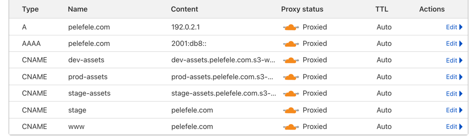

#### Introduction

Application is making use of 2 domains.

API domain: alb.awss.ws 
WebApp domain: pelefele.com

#### Route53 config for AWSS.WS

Create new hosted zone: awss.ws

Name servers should be configured to resolve domains using AWS name servers.

Note hosted zone id, will be required to be part of AWS Secret: HOSTED_ZONE_ID

#### Domain setup documentation

API endpoint
alb.awss.ws 

Static website:
pelefele.com
stage.pelefele.com
localhost:3000

### Cloudflare DNS settings for application

Check cloudflare workers config (admin UI and wrangler.toml) for domains:

pelefele.com 
stage.pelefele.com

### Cloudflare

Deploy stack and add DNS entries for s3 buckets mapping. This will allow to serve
S3 assetts (uploaded images) via CF CDN.

CNAME prod-assets    prod-assets.pelefele.com.s3-website.me-south-1.amazonaws.com
CNAME stage-assets   stage-assets.pelefele.com.s3-website.me-south-1.amazonaws.com
CNAME dev-assets     dev-assets.pelefele.com.s3-website.me-south-1.amazonaws.com

### DNS domain setting

Final settings

